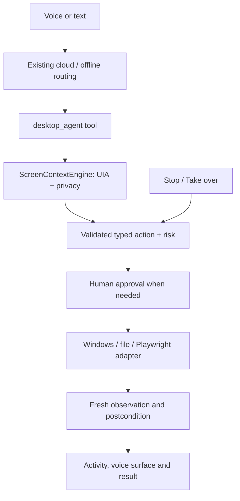

# Assistant Worker

A Windows desktop assistant built with Python, PyQt6 and Gemini Live, with local
speech and deterministic desktop controls when offline. The desktop-agent
migration adds structured screen context, explicit action verification and
visible privacy controls while retaining the existing voice and tray facade.

**Status:** an incremental implementation, not completion of every workflow in
the product brief. See [delivery status and limitations](docs/implementation-report.md)
and the [repository audit / migration plan](docs/architecture-upgrade.md).

## Features

- Conversation-focused window with compact Settings and Memory navigation.
- Original audio-reactive voice surface, eleven named states, fast attack / slow
  release, reduced motion and hidden-window timer suppression.
- Floating voice controller with saved position, microphone, keyboard, sharing,
  stop and compact controls; existing push-to-talk can reveal it.
- Screen off / current window / application / desktop sharing scopes.
- Windows UI Automation observations, foreground/focus event invalidation,
  bounded tree enumeration and ephemeral current-window screenshots.
- Exact/focused/cursor/ordinal reference resolution; ambiguous targets ask for
  clarification instead of choosing the first match.
- Typed single actions with validation, risk classification, human confirmation,
  observable postconditions and bounded verification attempts.
- Verified local file copies/moves using content hashes, exclusive destination
  creation and no automatic overwrites.
- Playwright DOM navigation, unique-target clicks and literal field filling,
  with postcondition checks and password-field refusal.
- Short-lived Downloads / newest PDF context, compact action history and optional
  temporary target highlights.
- Existing cloud voice, local intent routing, memory, tray, reminders and plugins
  remain available subject to their installed providers and the migration guard.

## Installation and development

Use Windows 10/11 and Python 3.11 or newer. A clean virtual environment is
recommended; optional speech packages may not have wheels for every Python
version. Verification on this machine used Python 3.14.4.

```powershell
git clone https://github.com/suragms/assistant-worker-ai.git
cd assistant-worker-ai
py -m venv .venv
.\.venv\Scripts\Activate.ps1
python -m pip install -r requirements.txt
python -m playwright install chromium
python main.py
```

For an existing checkout, run the installation commands from its root. Keep
credentials out of source control. The normal setup dialog and existing
configuration manager store preferences under
`%LOCALAPPDATA%\AssistantWorker\config\api_keys.json`.

## Configuration

Open **Settings** for general/startup controls, voice devices, offline models,
assistant customization, screen/privacy/appearance and developer logs.

In **Screen, privacy & appearance** select a sharing scope, enter comma-separated
process/window glob patterns, choose private-window exclusions, reduced motion,
Dark/Light/System appearance, and optional action highlights. New UI preferences
and floating position use Qt QSettings under AssistantWorker/DesktopAgent;
existing voice/API preferences keep their original storage.

Sharing always starts **off**. Enable it deliberately, then focus the application
of interest. Once an external window has been observed, opening the assistant to
type retains that external window as context. Closed/replaced windows and
exclusion checks invalidate that reference.

The global hold-to-talk setting uses the existing hotkey implementation. Floating
voice is also available directly from the conversation controls. Keyboard
shortcuts remain Ctrl+Space (talk), Ctrl+M or F4 (mute), Escape (interrupt), F11
(fullscreen).

## Screen awareness and privacy

UI Automation supplies structured names, roles, bounds, focus and selection.
WinEvents mark observations stale; a ten-second cache limit supplements events.
The visible context chip and floating controller show the active sharing scope.
Screen off stops observation and clears cached context. Clear discards cached and
in-flight context; queued vision data carries a generation check before upload.

Password-manager process patterns and banking/private-window title patterns are
excluded by default. UIA password controls are redacted. These are heuristics,
not a guarantee that every sensitive application is recognized: add exclusions
for your applications before sharing. A cloud observation can send the permitted
structured window content or requested screenshot to the configured provider.

Visual capture is limited to the selected current window. It is refused for a
protected or incomplete accessibility tree. Images are resized to at most 1280
pixels on either dimension and kept in memory. Screenshot saving requires a
specific screenshot action; new PNG/JPEG files are created without overwriting
existing files. App/Desktop scope currently supports structured context only.

Action logs contain IDs, type, duration, status and verification outcome; arguments,
field values, raw screenshots and literal targets are omitted from those logs.
Existing unrelated legacy logs are not a comprehensively audited privacy boundary.

## Automation safety

The desktop agent follows observe → validate → classify risk → act once → observe
→ verify. A successful input event is not success. Results distinguish completed,
unverified, failed, stopped, busy and confirmation-pending states.

The UI issues approval; model-supplied `approved`/`confirmed` fields cannot approve
a typed action. High-risk approvals are bound to the observed target or file
identity. Pending approvals cannot overwrite each other. Stop cancels pending
approval and latches automation off until fresh user input. Pause/Continue control
the current task at execution checkpoints.

Ordinary structured navigation and non-password text entry do not require
confirmation. Destructive files, uncertain clicks and external submissions are
conservative. Legacy blind coordinate clicks and unrestricted generated desktop
code are disabled at the dispatcher boundary; use `desktop_agent` instead.
Legacy and third-party plugins are not all migrated to this verifier.

## Cloud and offline behavior

Gemini Live remains the cloud voice provider. Existing Automatic, Cloud Only and
Offline Only modes and connection badges are retained. Local app launch, volume,
time/date and other deterministic intents remain in the offline router. Local
STT/TTS requires its optional engines/models. Offline reminders now report when
no reminder was scheduled instead of claiming a nonexistent reminder exists.

The smoke-test mode below never starts microphone, network reasoning or screen
sharing. A passing smoke test is not evidence of live cloud or microphone quality.

## Architecture



`main.py` retains voice/session orchestration. `core/agent_actions.py` defines
contracts and execution, `core/agent_runtime.py` binds services and adapters,
`core/windows_context.py` owns Windows observation, and `core/browser_agent.py`
uses the existing browser session owner. `theme.py` centralizes the compatibility
palette and semantic tokens. Extracted builders/widgets live under `widgets/`;
`ui.py` remains the compatibility facade during gradual migration.

## Runtime performance policy

The runtime combines the selected **ECO**, **BALANCED**, or **PERFORMANCE** mode
with available-RAM pressure. The governor uses hysteresis to avoid toggling
policy while memory hovers around a threshold. The resulting policy controls
voice-orb idle/active FPS, monitor cadence, screen-capture dimensions, and
whether optional model/browser prewarming is allowed.

The voice animation timer stops when its window is hidden or minimized, when
muted, and when reduced motion is enabled. Gemini's SDK is lazy-loaded on the
first cloud request rather than during initial application import. Live-session
connection triggers are single-flight, so voice, hotkey, UI, and reconnect paths
share one connection attempt.

Capture frames are resolution-capped by the current policy. Screen-change
detection keeps only a 160×90 grayscale thumbnail between comparisons rather
than retaining full-resolution screen images.

See the reproducible [Phase 2 benchmark summary](reports/phase2_summary.md),
[stability exercise](scripts/stress_phase2.py), and
[after-measurement script](scripts/measure_phase2_after.py).

## Tests and build

```powershell
python -m pip install pytest
python -m pytest -q
python test_paint_stress.py

# Opt-in tests on an interactive Windows desktop:
$env:AW_WINDOWS_TESTS = '1'
python -m pytest -q tests/test_windows_agent.py

# Source startup check, without audio/network:
python main.py --smoke-test --report build/source-smoke.json

# Windows executable:
python -m pip install -r requirements-build.txt
python -m PyInstaller --noconfirm --clean AssistantWorker.spec
.\dist\AssistantWorker\AssistantWorker.exe --smoke-test --report build/packaged-smoke.json
```

Use `AssistantWorker-debug.spec` for a console-enabled diagnostic build. Distribute
the whole `dist/AssistantWorker` folder, including `_internal`. The build isolates
native DLL discovery from unrelated programs on PATH; do not manually copy DLLs
from other applications into the bundle. Optional engines absent from the build
environment are absent from the executable too.

## Screenshots


The screenshot is an actual source smoke-test render, with microphone and cloud
disabled. Additional documentation slots: floating mode, active task verification,
and light theme. These are pending captures, not claimed completed acceptance tests.

## Troubleshooting

- **Screen off/protected:** enable Current window sharing, focus the target, and
  inspect your exclusions. UAC/elevated apps and inaccessible UIA controls may be
  unavailable. Do not elevate the assistant merely to bypass those restrictions.
- **Ambiguous target:** use the exact observed element ID/name or identify its list.
- **Action attempted but unverified:** inspect the result before retrying. The
  executor deliberately did not replay the action.
- **Browser page changed:** focus the managed browser page and observe again.
  DOM access cannot attach to every arbitrary existing browser tab.
- **Packaged Qt DLL error:** rebuild cleanly with the supplied spec. A DLL copied
  from an unrelated PATH installation can have the same name and incompatible
  exports; the build helper prevents the diagnosed ICU collision.
- **Offline voice unavailable:** install the selected STT/TTS engine and models;
  a connection badge does not mean an absent speech package was bundled.
- **Windows integration skipped:** Windows may deny foreground activation in a
  noninteractive test session. Run the marked test on an interactive desktop.
- **Diagnostics:** Settings → Developer logs; persistent logs remain under
  `%LOCALAPPDATA%\AssistantWorker\logs`.

## Migration

No user-memory or API-config migration is required. Existing imports from `ui`
remain compatible. Theme, header, conversation renderer and voice panel have
moved into modules; the voice surface is upgraded in place. The old hidden HUD
remains for camera/video compatibility and its idle animation timer is stopped.
No remote was changed and no release was published by this migration.

See [implementation report](docs/implementation-report.md) for verification,
unsupported actions, performance limits and the remaining acceptance work.
