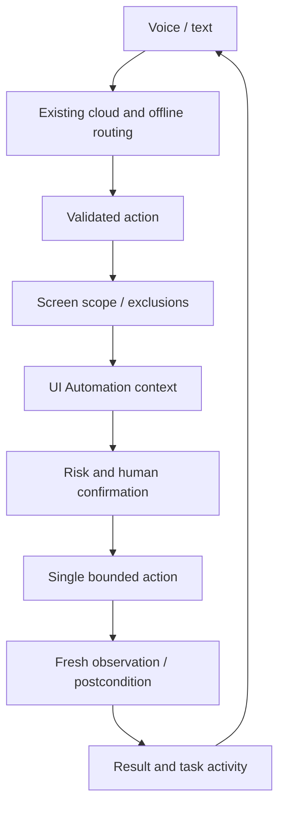

# Desktop agent migration

## Audit and baseline — 2026-10-05

The clean checkout has `origin` (Jarvis-Ai) and `worker-ai` (the requested
assistant-worker-ai repository). No remote or branch was changed.

`main.py` owns Gemini Live sessions, microphone/output streaming, interruption,
offline routing, tool execution, memory and dashboard wiring. Tool calls already
run in an executor. `ui.py` contains the Qt facade, window, legacy HUD, overlays,
theme, metrics and conversation log. It is approximately 7,000 lines.
`widgets/voice_orb.py` is already fed real microphone and speaker amplitudes.
`core/confirm.py` issues approvals through the UI, never through model arguments.
`core/offline_fallback.py` owns deterministic local intents and reconnection.
`actions/browser_control.py` already has a Playwright session/event-loop manager.
`actions/computer_control.py` and `actions/desktop.py` retain legacy input and
generated-code paths; these are not a verified agent pipeline. Memory/config
live under the user data directory. Plugins and actions are discovered at startup.
The dashboard is a separate optional FastAPI service. Both PyInstaller specs
collect dynamically discovered action sources and explicit hidden imports.

Baseline: `python -m pytest -q test_hybrid_mode.py test_voice_panel.py
test_paint_stress.py _test_ui.py`: **10 passed, 1 failed**, 13.24 seconds.
The existing failure is the meter test expecting 42 immediately, while the
meter is updated by a 33 ms timer. Existing warnings: deprecated pynvml and two
tests returning booleans. The paint stress script exposes `run_stress`, so it
must also be run directly. Packaged verification executes at import time and
requires a prebuilt dist folder; it must not be collected as a unit test.

## Architecture and ordered migration

1. Extract shared theme and conversation rendering with compatibility exports.
2. Upgrade the existing orb in place, retain its public API and real audio feed.
3. Add independent screen context models, privacy policy, bounded UIA observer,
   event invalidation and ephemeral capture. Default screen sharing is OFF.
4. Add validated typed actions, independent risk classification, task control,
   fresh observations and explicit postconditions. Do not replay side effects
   merely because verification is delayed.
5. Connect through existing action discovery and voice/text routing. Add compact
   context, activity and floating controls through Qt signals. Keep heavy work
   off the GUI thread.
6. Reuse Playwright for DOM access, retain offline local intents and existing
   settings. Verify tests, Windows adapters and packaging separately.

Screen content is untrusted data, never authority to issue actions or approve
them. Approval is bound to the concrete action. Logs omit arguments, field
values and screenshots. Unsupported operations fail explicitly. Compatibility
exports avoid breaking existing imports while modules are extracted.
